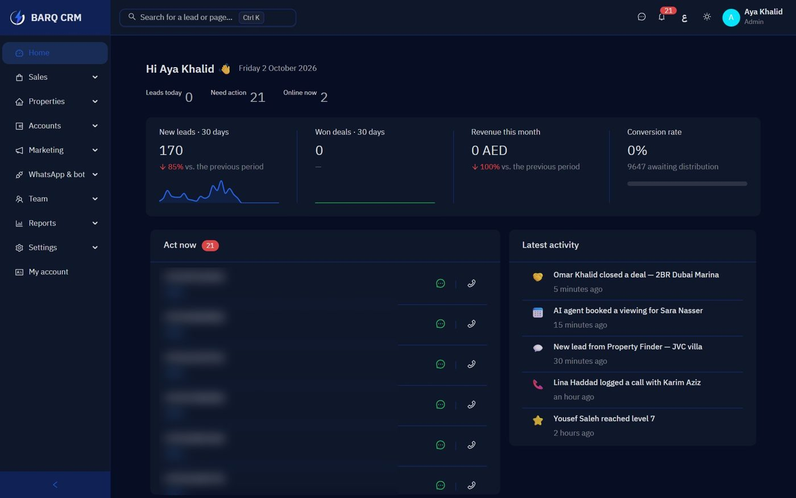
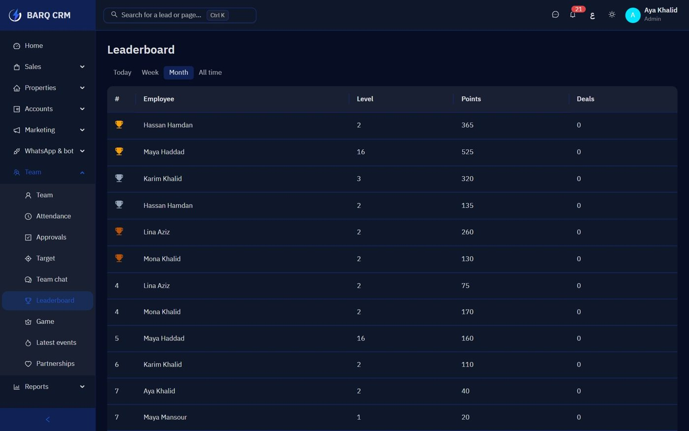

  

<h1 align="center">Hussein Hesham</h1>

  <b>Co-Founder @ <a href="https://barq360.ae">Barq 360</a></b> · Full-Stack & AI Engineer · Abu Dhabi, UAE

  I build AI-powered CRMs and WhatsApp sales agents that answer every lead in seconds — day or night, in Arabic and English.

  
  
  

---

## What I've built

### ⚡ Barq 360 — AI CRM + WhatsApp Sales Agent · [barq360.ae](https://barq360.ae)

A bilingual CRM where an **AI agent replies to every WhatsApp lead in seconds, 24/7**, qualifies them and books the meeting. The team runs the business from WhatsApp too — an AI assistant creates leads, logs calls from voice notes, drafts contracts, quotes and invoices as PDF, and sends the daily report.

  

Flask · PostgreSQL · React + Ant Design Pro · WhatsApp Cloud API · OpenAI · Docker

### 🎮 Lead Hunter — Gamified Real-Estate CRM

A sales CRM that turns calls, messages, meetings and deals into a game — XP, levels, quests, leaderboards, competitions, and a 3D city the team drives through.

  

Flask · PostgreSQL RPCs · PostgREST · Supabase Auth · Three.js · PWA

### 📸 [Headshot Studio](https://github.com/heshamhussin961-design/headshot-studio) — open source

Turn any selfie into a professional studio headshot in ~30 seconds. Identity-preserving, four looks, one-click deploy.

Next.js · TypeScript · OpenAI Image API

---

## Stack

  

Terminal card generated with <a href="https://github.com/pangeran-droid/ascii-profile-card">ascii-profile-card</a> (MIT).

